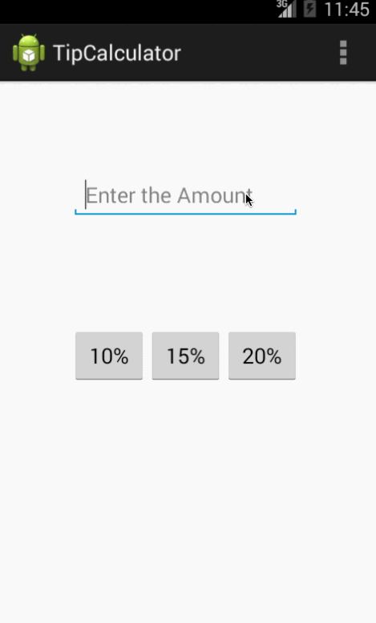

tip_calculator
==============

This repo contains the first week assignment the TipCalculator.

Time spent : 2 hours

Completed User Stories:

   * User is displayed the tip of specified percentage for specified entered amount  
   * User enters the total amount of the transaction
   * User can select between tip amounts (i.e 10%, 15%, 20%) 
   * Upon selecting tip amount, formatted tip value is displayed
   * (Optional) User changes the total amount and updated tip is reflected automatically

## Demo

